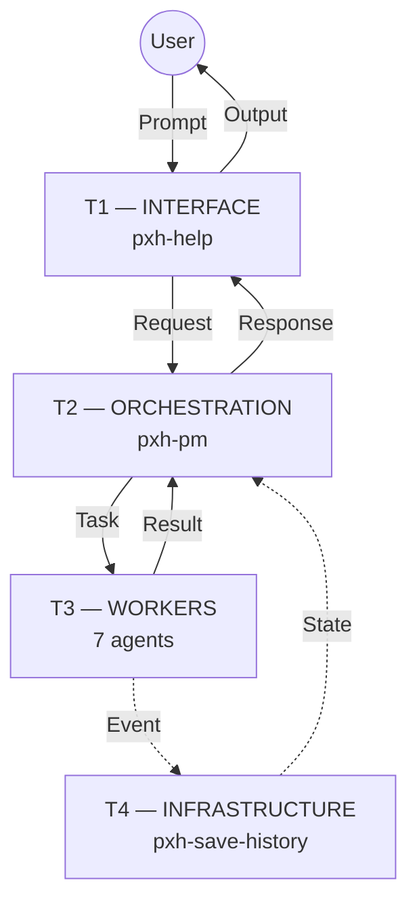

# pxhopencode — AI Company cho Vibe Coding

<p align="center">
  <b>v46</b> &nbsp;·&nbsp; 72 commits &nbsp;·&nbsp; 10 AI agents &nbsp;·&nbsp; 4-tier runtime &nbsp;·&nbsp; 9 workflows &nbsp;·&nbsp; 11 commands &nbsp;·&nbsp; 32 skills &nbsp;·&nbsp; 159 templates</p>

> AI Company tự động: prompt → classify → route → code → test → fix → review → build → persist. Một luồng duy nhất, không cần can thiệp tay.

---

## Cài đặt

Clone vào project của bạn, đổi tên thành `.opencode`:

```bash
# Trong thư mục project của bạn
git clone <repo-url> .opencode
# hoặc download zip, giải nén, rename pxhopencode → .opencode
```

Sau đó dùng opencode mở project → agent tự động load cấu hình từ `.opencode/opencode.json`.

---

## Văn Phòng Ảo — Khởi động nhanh

Webview 2D Open Office — văn phòng mở với 10 nhân vật pixel-art, real-time sync với TUI:

### Cách 1: File .bat (khuyên dùng)

```powershell
# ON — Start server + mở browser
.\pxh-office-on.bat

# OFF — Tắt server
.\pxh-office-on.bat off

# RESTART — Tắt cũ + start mới + mở browser
.\pxh-office-on.bat restart
```

### Cách 2: Chạy tay

```powershell
node skills/virtual-office/templates/server.mjs
start http://localhost:2910
```

### Sync real-time với TUI (tùy chọn)

```powershell
.\skills\virtual-office\templates\hook-opencode.ps1 "your prompt here"
```

Script này chạy opencode, bắt tên agent từ output TUI và gửi state real-time lên webview.

---

## Kiến trúc Runtime 4 Tầng



| Tầng | Agent | Vai trò | Rời bàn |
|------|-------|---------|---------|
| **T1** Interface | `pxh-help` | Validate & classify input | Khi TUI kết thúc |
| **T2** Orchestration | `pxh-pm` | Route, policy, retry/recovery | Khi TUI kết thúc |
| **T3** Workers | 7 agents | Code, test, fix, review, build, UI/UX | Xong việc → rời |
| **T4** Infrastructure | `pxh-save-history` | State, checkpoint, log | Xong việc → rời |

---

## 10 Agents

| Agent | Tầng | State Badge | Dùng khi |
|-------|------|-------------|----------|
| `pxh-help` | T1 | **INTERFACE** | Validate & classify input |
| `pxh-pm` | T2 | **ORCHESTRATION** | Điều phối, routing, policy |
| `pxh-architect` | T3 | **DESIGN** | Thiết kế tech stack, DB, API |
| `pxh-expert` | T3 | **CODE** | Vibe code, production |
| `pxh-fix-bugs` | T3 | **DEBUG** | Root cause → fix bug |
| `pxh-qa` | T3 | **TEST** | Viết & chạy test |
| `pxh-review-code` | T3 | **REVIEW** | Security, perf audit |
| `pxh-devops` | T3 | **BUILD** | Lint → typecheck → test → build |
| `pxh-ui-ux` | T3 | **DESIGN** | Layout, responsive, accessibility |
| `pxh-save-history` | T4 | **INFRASTRUCTURE** | State, checkpoint, recovery |

---

## 9 Workflows · 11 Commands

| Lệnh | Mục đích |
|------|----------|
| `/vibe` | Toàn bộ quy trình (phân tích → code → test → review → build) |
| `/web` | Web app (React, Next.js, Express, FastAPI) |
| `/game` | Game HTML5 (Phaser 2D, Isometric, Three.js 3D) |
| `/ai` | Chatbot, RAG, agent, LLM |
| `/tool` | CLI, extension, automation, package |
| `/debug` | Debug + fix bug |
| `/ui-ux` | UI/UX design & debug |
| `/meeting` | Họp agents thảo luận |
| `/release` | Build pipeline: lint → test → build |
| `/preview` | Live preview game (Vite HMR) |
| `/office` | Virtual Office — real-time 4-tier visualization |

---

## Cách dùng

| Cách | Cú pháp | Luồng |
|------|---------|-------|
| **Prompt tự nhiên** | Gõ thẳng mô tả công việc | `pxh-pm` classify → chọn workflow → route → code → test → review → build |
| **Lệnh `/`** | `/workflow` + mô tả | Load workflow template → route thẳng T3 |
| **@mention** | `@agent` + task contract | Gọi agent cụ thể, bỏ qua classify |

---

## Chính sách

| Policy | Cơ chế | Giới hạn |
|--------|--------|----------|
| **Retry** | Exponential backoff (1s → 2s → 4s) | Max 3 lần |
| **Recovery** | Checkpoint-based resume / rollback | Lỗi permanent |
| **Reflection** | 4 mức: Task → Phase → Workflow → Incident | Ghi session log |

---

## Virtual Office — Chi tiết

### Thiết kế văn phòng mở

Văn phòng single-floor open space, toàn bộ 10 agent làm việc chung:

- **Tường trái**: 4 server rack LED nhấp nháy
- **Trung tâm**: Bàn CEO PXH, 7 bàn worker (3 monitor + 4 laptop)
- **Góc trái dưới**: Historian
- **Góc phải dưới**: Help Desk + cửa ra vào
- **Tường phải**: Bảng trắng, water cooler, coffee machine
- **Trang trí**: Cây cảnh 3 kiểu, đồng hồ treo tường, banner PXH2910
- **Thú cưng**: Mèo vàng 🐱 + Chó nâu 🐕 đi dạo tự do

### Tính năng

| Animation | Mô tả |
|-----------|-------|
| **Walking** | Agent đi lại 4 hướng, body nảy |
| **Typing** | Ngồi vào bàn, quay lưng gõ phím, tay rung |
| **Idle breathing** | Đứng thở + nháy mắt |
| **Dashed signals** | Tín hiệu xanh nối giữa các agent |
| **Speech bubbles** | Log real-time trên đầu agent |
| **State badges** | Nhấp nháy bên phải tên chức danh |
| **Đã làm xong** | Bay lên từ agent khi hoàn thành |

### Trang phục agent

| Agent | Trang phục | Phụ kiện |
|-------|-----------|----------|
| Help Desk | Váy xanh dương A-line | Huy hiệu ★ |
| CEO PXH | Suit đen + vest kem | Cà vạt vàng + kẹp |
| Architect | Váy tím A-line | Kính tròn |
| Developer | Hoodie xanh lá | Kính tròn |
| Bug Hunter | Jacket đỏ sọc | Huy hiệu ★ |
| QA Engineer | Váy xanh ngọc chấm bi | — |
| Reviewer | Áo sơ mi vàng | Cà vạt đỏ |
| DevOps | Hoodie xanh navy | Kính tròn |
| UI/UX Designer | Váy hồng | Khăn quàng |
| Historian | Cardigan tím | Kính tròn |

### Real-time Sync

| Cơ chế | Mô tả |
|--------|-------|
| **Bridge** | Watch file changes → gửi event SSE |
| **Hook** | Bắt tên agent từ TUI output → gửi state |
| **State file** | `_shared/opencode-state.json` → server watch |
| **SSE** | Push real-time tới browser |

### Gửi event mô phỏng

```powershell
# Pipeline đầy đủ
Invoke-RestMethod -Uri "http://localhost:2910/simulate" -Method Post -Body '{"count":1}' -ContentType "application/json"

# Emit từng event
node skills/virtual-office/templates/emit-event.mjs --type agent_state --agent pxh-expert --tuiState Code --message "Test"
```

---

## Key Concepts

- **Context Budget**: T0→T3 loading, lazy skill/template, batch ops
- **Compaction**: Auto nén context cũ → summary, giữ 3 turns gần nhất
- **Tool Output**: `max_lines: 50, max_bytes: 4096` — tiết kiệm token
- **Live Preview**: `skills/games-preview/` — Vite HMR, hot-reload < 50ms
- **Code preservation**: Chỉ tác động trong TARGET
- **Portable**: Copy toàn bộ `.opencode` → hoạt động ngay trong project mới

---

## Changelog

<details>
<summary><b>v46 — Open Office & Real-time Agent Sync (Latest)</b></summary>

- **Redesign:** Virtual Office thành văn phòng mở single-floor, 10 agent làm việc chung
- **Add:** 10 agent với pixel-art character, trang phục riêng, phụ kiện
- **Add:** Mèo 🐱 + Chó 🐕 đi dạo tự do trong văn phòng
- **Add:** Speech bubble real-time multi-dòng với timestamp
- **Add:** Dashed signal lines thay giấy tờ bay, nối agent theo kiến trúc
- **Add:** State badge nhấp nháy bên phải tên chức danh (Interface/Orchestration/...)
- **Add:** T1+T2 ở lại tới global idle, T3+T4 rời bàn khi xong việc
- **Add:** `pxh-office-on.bat` — ON/OFF/RESTART server 1 lệnh
- **Update:** Bridge per-agent idle timer + pipeline theo workflow
- **Update:** `hook-opencode.ps1` — bắt tên agent từ TUI output real-time
- **Update:** Port mặc định 2910, Cache-Control headers
- **Fix:** HiDPI layout bug, path traversal, ASI semicolon bugs
- **Fix:** `drawOutfit` váy A-line phủ kín, tóc `slick`/`sidepart`/`short`
</details>

<details>
<summary><b>v45 — Virtual Office TUI</b></summary>

- **Add:** `pxh-office` agent — Virtual Office TUI với pixel-art agents
- **Add:** Webview 2D Cartoon — văn phòng 4 tầng trên browser
- **Add:** SSE event sync + contract flow animation
</details>

<details>
<summary><b>v44 — Context Compaction & AI Studio Live Preview</b></summary>

- **Add:** Context compaction, tool output truncation, skill lazy loading
- **Add:** `games-preview` skill — Vite HMR live preview
</details>

<details>
<summary><b>v43 — Game Polish & AI Studio Quality</b></summary>

- **Add:** AI Studio debug pipeline, Polish Pipeline, game eval assertions
</details>

<details>
<summary><b>v42 — Godot Removal</b></summary>

- **Remove:** Godot agent, skills, workflow
</details>

<details>
<summary><b>v40 — Architecture Hardening</b></summary>

- **Add:** Observability & Alerting (T4), Contract versioning, Mermaid diagrams
</details>

<details>
<summary><b>v32 — Initial Foundation</b></summary>

- **Add:** 4-tier architecture, 10 agents, 8 workflows, 28 skills
- **Add:** Contract system, Retry/Recovery/Reflection policies
</details>
