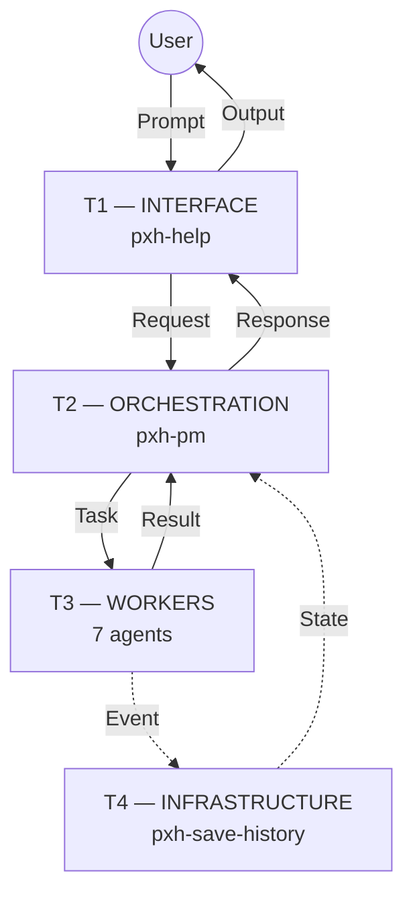
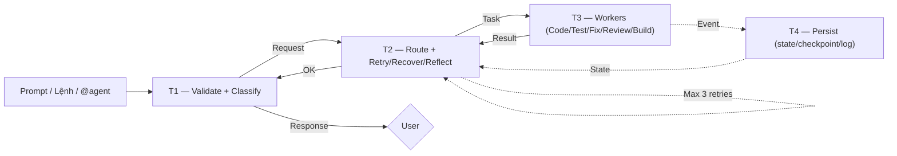

# pxhopencode — AI Company cho Vibe Coding

<p align="center">
  <b>v40</b> &nbsp;·&nbsp; 53 commits &nbsp;·&nbsp; 10 AI agents &nbsp;·&nbsp; 4-tier runtime &nbsp;·&nbsp; 8 workflows &nbsp;·&nbsp; 30 skills &nbsp;·&nbsp; 167 templates</p>

> AI Company tự động: prompt → classify → route → code → test → fix → review → build → persist. Một luồng duy nhất, không cần can thiệp tay.

> **Sync:** Sau khi CRUD agent/workflow/skill/template, chạy `powershell.exe -ExecutionPolicy Bypass -File _shared\sync-readme.ps1` để đồng bộ badge + section headers.

---

## Kiến trúc Runtime 4 Tầng



| Tầng | Agent | Vai trò |
|------|-------|---------|
| **T1** Interface | `pxh-help` | Validate input, classify prompt, format output |
| **T2** Orchestration | `pxh-pm` | Auto-route task, track state, enforce retry/recovery/reflection |
| **T3** Workers | 7 agents | Thực thi domain (code, test, review, build, UI/UX) |
| **T4** Infrastructure | `pxh-save-history` | Persist state, checkpoint, log, alerting |



---

## 10 Agents

| Agent | Tầng | Role | Dùng khi |
|-------|------|------|----------|
| `pxh-pm` | T2 | Điều phối, routing, policy | Chạy lệnh `/`, giao việc tự động |
| `pxh-architect` | T3 | Thiết kế tech stack, DB, API | Cần kiến trúc hệ thống |
| `pxh-expert` | T3 | Vibe code, workflow + skill | Code production, tính năng mới |
| `pxh-fix-bugs` | T3 | Root cause → fix | Bug, crash, behavior sai |
| `pxh-qa` | T3 | Test, validate | Chạy test, verify chất lượng |
| `pxh-review-code` | T3 | Security, perf, convention | Code review, audit |
| `pxh-devops` | T3 | Lint → typecheck → test → build | Build pipeline, release |
| `pxh-ui-ux` | T3 | UI/UX design (web, game HUD, CLI) | Layout, responsive, accessibility |
| `pxh-save-history` | T4 | State, checkpoint, recovery | Lưu session, phục hồi lỗi |
| `pxh-help` | T1 | Hướng dẫn workflow | Cần trợ giúp, chưa biết bắt đầu |

---

## 8 Workflows · 9 Commands

| Lệnh | Mục đích |
|------|----------|
| `/vibe` | Toàn bộ quy trình (phân tích → code → test → review → build) |
| `/web` | Web app (React, Next.js, Express, FastAPI) |
| `/game` | Game HTML5 (Phaser 2D, Isometric, Three.js 3D) |
| `/ai` | Chatbot, RAG, agent, LLM |
| `/tool` | CLI, extension, automation, package |
| `/debug` | Debug + fix bug |
| `/ui-ux` | UI/UX design & debug cho web, game, tool |
| `/meeting` | Họp agents thảo luận |
| `/release` | Build pipeline: lint → test → build |

---

## 30 Skills

Xem danh sách đầy đủ: [`_shared/skill-quickref.md`](_shared/skill-quickref.md) (Web 8, Game 11, AI 5, Tool 5, Chuyên biệt 1)

---

## Cách dùng

```bash
# Prompt trực tiếp — pxh-pm tự động classify → route → code → test → release
"Làm một web app TODO list với Next.js"

# Lệnh / — xác định workflow rõ ràng
/vibe   "Game bắn súng 2D, có shop, 10 level"
/debug  "Fix bug, crash, behavior sai"
/ui-ux  "Fix responsive layout và dark mode"

# @agent — gọi trực tiếp kèm Task contract
@pxh-expert với phase=code target=./src context="Thêm API route GET /users"
```

---

## Chính sách

| Policy | Cơ chế | Giới hạn |
|--------|--------|----------|
| **Retry** | Exponential backoff (1s → 2s → 4s) | Max 3 lần, lỗi tạm thời |
| **Recovery** | Checkpoint-based resume / rollback | Lỗi permanent |
| **Reflection** | 4 mức: Task → Phase → Workflow → Incident | Ghi vào session log |

---

## Key Concepts

- **Context Budget**: T0→T3 loading, lazy skill/template, batch ops
- **Genre Reference**: `_shared/game-genre-reference.md`
- **Headless testing**: Vitest + headless Phaser/Three.js, không cần server
- **Code preservation**: Chỉ tác động trong TARGET
- **Templates**: `_shared/templates/` (status, session, gitignore, bug-report, adr)

---

## Changelog

### v40 — Architecture Hardening (Latest)
- **Add:** `pxh-ui-ux.md` agent file, `_shared/arch-check.ps1`, `_shared/sync-readme.ps1`
- **Add:** Observability & Alerting (T4), Contract versioning (`v:"1.0"`), CLI Design System
- **Add:** Mermaid flowcharts thay ASCII diagrams
- **Fix:** `opencode.json` command format (schema-compliant), thiếu Verification sections
- **Fix:** Agent permission boilerplate xoá (~246 tokens)
- **Update:** Auto-routing (pxh-pm + pxh-help), README/runtime/README nén
- **Remove:** Mod APK/XAPK khỏi toàn bộ codebase

### v39 — Pro Max
- **Add:** Anti-Rationalization + Red Flags + Verification cho 47 files
- **Update:** Token optimization, workflow compression, context budget

### v32 → v38
Xem chi tiết tại `git log` hoặc file `_shared/arch-check.ps1`.
