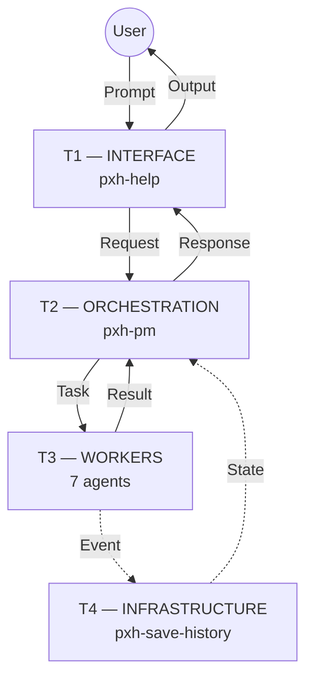
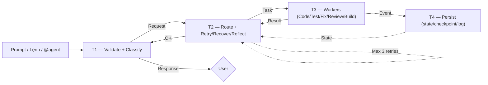

# pxhopencode — AI Company cho Vibe Coding

<p align="center">
  <b>v45</b> &nbsp;·&nbsp; 71 commits &nbsp;·&nbsp; 11 AI agents &nbsp;·&nbsp; 4-tier runtime &nbsp;·&nbsp; 9 workflows &nbsp;·&nbsp; 11 commands &nbsp;·&nbsp; 32 skills &nbsp;·&nbsp; 159 templates</p>

> AI Company tự động: prompt → classify → route → code → test → fix → review → build → persist. Một luồng duy nhất, không cần can thiệp tay.

---

## Cài đặt

Clone vào project của bạn, đổi tên thành `.opencode`:

```bash
# Trong thư mục project của bạn
git clone <repo-url> .opencode
# hoặc download zip, giải nén, rename pxhopencode → .opencode
```

Sau đó dùng opencode mở project → agent tự động load cấu hình từ `.opencode/opencode.json`.

### MCP Servers (tùy chọn)

MCP servers mở rộng khả năng của AI Company — có thể là local (VD: database, game engine) hoặc remote (VD: API, cloud service).

Thêm vào `opencode.json` trong project của bạn (xem cấu hình mẫu trong file này):

```json
"mcp": {
  "<server-name>": {
    "type": "local",
    "command": ["<lệnh>", "<arg>", ...],
    "enabled": true,
    "environment": {
      "KEY": "value"
    }
  }
}
```

Ví dụ cụ thể — local database MCP server:
```json
"mcp": {
  "database": {
    "type": "local",
    "command": ["npx", "-y", "@your-org/db-mcp"],
    "enabled": true,
    "environment": {
      "DB_URL": "postgresql://..."
    }
  },
  "api-service": {
    "type": "remote",
    "url": "https://api.example.com/mcp",
    "headers": { "Authorization": "Bearer <token>" },
    "enabled": true
  }
}
```

**Local** (`"type": "local"`): chạy process trên máy bạn. Cần `command` là đường dẫn executable + args.
**Remote** (`"type": "remote"`): kết nối đến MCP server qua URL. Cần trường `url` + `headers` nếu có auth.

Chi tiết: [opencode.ai/docs/mcp](https://opencode.ai/docs/mcp).

---

## Kiến trúc Runtime 4 Tầng



| Tầng | Agent | Vai trò |
|------|-------|---------|
| **T1** Interface | `pxh-help` | Validate input, classify prompt, format output |
| **T2** Orchestration | `pxh-pm` | Auto-route task, track state, enforce retry/recovery/reflection |
| **T3** Workers | 7 agents | Thực thi domain (code, test, review, build, UI/UX) |
| **T4** Infrastructure | `pxh-save-history` | Persist state, checkpoint, log, alerting |



---

## 11 Agents

| Agent | Tầng | Role | Dùng khi |
|-------|------|------|----------|
| `pxh-pm` | T2 | Điều phối, routing, policy | Chạy lệnh `/`, giao việc tự động |
| `pxh-architect` | T3 | Thiết kế tech stack, DB, API | Cần kiến trúc hệ thống |
| `pxh-expert` | T3 | Vibe code, workflow + skill | Code production, tính năng mới |
| `pxh-fix-bugs` | T3 | Root cause → fix | Bug, crash, behavior sai |
| `pxh-qa` | T3 | Test, validate | Chạy test, verify chất lượng |
| `pxh-review-code` | T3 | Security, perf, convention | Code review, audit |
| `pxh-devops` | T3 | Lint → typecheck → test → build | Build pipeline, release |
| `pxh-ui-ux` | T3 | UI/UX design (web, game HUD, CLI) | Layout, responsive, accessibility |
| `pxh-save-history` | T4 | State, checkpoint, recovery | Lưu session, phục hồi lỗi |
| `pxh-help` | T1 | Hướng dẫn workflow | Cần trợ giúp, chưa biết bắt đầu |
| `pxh-office` | Virtual | Virtual Office TUI | Visualize 4-tier architecture với pixel-art agents |

---

## 9 Workflows · 11 Commands

| Lệnh | Mục đích |
|------|----------|
| `/vibe` | Toàn bộ quy trình (phân tích → code → test → review → build) |
| `/web` | Web app (React, Next.js, Express, FastAPI) |
| `/game` | Game HTML5 (Phaser 2D, Isometric, Three.js 3D) |
| `/ai` | Chatbot, RAG, agent, LLM |
| `/tool` | CLI, extension, automation, package |
| `/debug` | Debug + fix bug |
| `/ui-ux` | UI/UX design & debug cho web, game, tool |
| `/meeting` | Họp agents thảo luận |
| `/release` | Build pipeline: lint → test → build |
| `/preview` | Live preview game (Vite HMR + browser auto-open) |
| `/office` | Virtual Office TUI — real-time 4-tier visualization |

---

## 32 Skills

Xem danh sách đầy đủ: [`_shared/skill-quickref.md`](_shared/skill-quickref.md) (Web 8, Game 12, AI 5, Tool 5, UI/UX 1)

---

## Cách dùng

Có 3 cách tương tác với AI Company — tất cả đều tự động route qua T1→T2→T3:

| Cách | Cú pháp | Luồng |
|------|---------|-------|
| **Prompt tự nhiên** | Gõ thẳng mô tả công việc | `pxh-pm` classify → chọn workflow → route → code → test → review → build |
| **Lệnh `/`** | `/workflow` + mô tả | Load workflow template → route thẳng T3 |
| **@mention** | `@agent` + task contract | Gọi agent cụ thể, bỏ qua classify |

### Prompt tự nhiên
```bash
"Làm một web app TODO list với Next.js"
# pxh-pm tự động phân tích, chọn workflow /web, gọi agent phù hợp
```

### Lệnh `/`
```bash
/vibe   "Game bắn súng 2D, có shop, 10 level"
/debug  "Fix bug crash khi login"
/ui-ux  "Fix responsive layout và dark mode"
```

### @mention
```bash
@pxh-expert với phase=code target=./src context="Thêm API route GET /users"
@pxh-architect thiết kế schema cho hệ thống chat
```

---

## Chính sách

| Policy | Cơ chế | Giới hạn |
|--------|--------|----------|
| **Retry** | Exponential backoff (1s → 2s → 4s) | Max 3 lần, lỗi tạm thời |
| **Recovery** | Checkpoint-based resume / rollback | Lỗi permanent |
| **Reflection** | 4 mức: Task → Phase → Workflow → Incident | Ghi vào session log |

---

## Văn Phòng Ảo — Test Nhanh

Webview 2D IT Office — văn phòng mở với canvas animation + Web Audio procedural sound:

```powershell
# 1. Start server (nếu chưa chạy)
node skills/virtual-office/templates/server.mjs

# 2. Mở browser xem webview
start http://localhost:3000
```

### Thiết kế văn phòng IT

| Khu vực | Mô tả |
|---------|-------|
| **T4 — Server Room** | 4 server rack với LED nhấp nháy, Historian làm việc |
| **T3 — Open Workspace** | 7 bàn làm việc (4 laptop + 3 monitor), cây cảnh |
| **T2 — PM Office** | Bàn CEO + bàn họp + water cooler |
| **T1 — Reception** | Help desk + cây cảnh + cửa ra vào |

### Tính năng animation

| Animation | Mô tả |
|-----------|-------|
| **Walking** | Nhân vật đi lại trong văn phòng khi idle |
| **Typing** | Ngồi vào bàn, tay gõ phím, màn hình hiện code |
| **Contract fly** | Giấy tờ 📄 bay giữa các tầng |
| **Idle breathing** | Nhân vật thở + đung đưa nhẹ |
| **Click agent** | Focus + bounce animation |

### Âm thanh procedural (Web Audio API)

| Sound | Khi nào |
|-------|---------|
| 🎵 Ambient hum | Luôn phát khi server chạy |
| ⌨️ Keyboard clicks | Khi agent đang typing |
| 👣 Footsteps | Khi agent walking |
| 🔔 Notification | Khi nhận event thật |
| 📄 Contract swish | Khi giấy tờ bay |
| 🚪 Door | Khi kết nối SSE |

Tắt/mở âm thanh: click nút 🔊/🔇 góc phải status bar.

### Cơ chế mô phỏng

| Chế độ | Indicator | Khi nào |
|--------|-----------|---------|
| **🔴 Live** | Đang nhận event thật từ Bridge/SSE | Agent làm việc theo event |
| **🟡 Mô phỏng** | Sau 10s không có event thật | Tự động chạy pipeline TUI (9 bước) |
| **⚡ Demo** | Mở file trực tiếp (file://) | Luôn tự mô phỏng |

### Gửi event mô phỏng pipeline TUI

```powershell
# Gửi 1 chu kỳ pipeline đầy đủ qua HTTP POST
Invoke-RestMethod -Uri "http://localhost:3000/simulate" -Method Post -Body '{"count":1}' -ContentType "application/json"

# Hoặc emit từng event CLI
node skills/virtual-office/templates/emit-event.mjs --type task_start --from pxh-pm --to pxh-expert --message "Test"
```

### Nếu báo lỗi port

```powershell
# Kill process cũ
taskkill /F /PID (Get-NetTCPConnection -LocalPort 3000 -ErrorAction Stop).OwningProcess

# Hoặc dùng port khác
$env:PORT=3001; node skills/virtual-office/templates/server.mjs
start http://localhost:3001
```

---

## Key Concepts

- **Context Budget**: T0→T3 loading, lazy skill/template, batch ops
- **Compaction**: Auto nén context cũ → summary, giữ 3 turns gần nhất, kéo session từ ~8 lên ~40 request
- **Tool Output**: `max_lines: 50, max_bytes: 4096` — cắt output tool tiết kiệm token
- **Live Preview**: `skills/games-preview/` — Vite HMR, hot-reload < 50ms, browser auto-open (AI Studio style)
- **Genre Reference**: `_shared/game-genre-reference.md`
- **Headless testing**: Vitest + headless Phaser/Three.js, không cần server
- **Code preservation**: Chỉ tác động trong TARGET
- **Templates**: `_shared/templates/` (status, session, gitignore, bug-report, adr)

---

## Changelog

<details>
<summary><b>v45 — Virtual Office TUI (Latest)</b></summary>

- **Add:** `pxh-office` agent — Virtual Office TUI với pixel-art agents, contract flow animation
- **Add:** `virtual-office` skill — zero-dependency Node.js TUI, demo + real mode
- **Add:** **Webview 2D Cartoon** — văn phòng hoạt hình 4 tầng trên browser (server.mjs + office.html)
- **Add:** `/office` command — mở Văn Phòng Ảo real-time 4-tier visualization (TUI + Webview)
- **Add:** Pixel-art agent cards: mỗi agent có Unicode icon riêng, highlight active agent
- **Add:** Contract flow visualization — mũi tên ↓ giữa các tầng, progress bar T3
- **Add:** Activity log với timestamp, real-time status bar (workflow, phase, elapsed)
- **Add:** SSE event sync — emit-event.mjs CLI/Module/HTTP bridge cho real-time đồng bộ
- **Update:** README counts — 11 agents, 9 workflows, 11 commands, 32 skills
- **Update:** `opencode.json` — `/office` command + `pxh-office` agent
- **Update:** `_shared/skill-quickref.md` — +1 Virtual Office skill
</details>

<details>
<summary><b>v44 — Context Compaction & AI Studio Live Preview</b></summary>

- **Add:** Context compaction — `opencode.json` compaction config với `strategy: summary`, `min_turns: 2`, `tail_turns: 3`. Kéo session từ ~8 lên ~40-50 request
- **Add:** Tool output truncation — `max_lines: 50, max_bytes: 4096` tiết kiệm ~30% token/turn
- **Add:** Skill lazy loading — `skills.lazy: true` chỉ load skill khi cần, không preload 31 skills
- **Add:** `games-preview` skill — Vite HMR live preview, hot-reload < 50ms, browser auto-open (AI Studio style)
- **Add:** `/preview` command — mở game preview dev server nhanh
- **Add:** Live Preview step — `workflows/game.workflow.md` Bước 3: code xong thấy ngay trước polish
- **Update:** `skill-quickref.md` — 12 game skills (thêm games-preview)
- **Update:** README counts — 70 commits, 10 commands, 31 skills, 159 templates
</details>

<details>
<summary><b>v43 — Game Polish & AI Studio Quality</b></summary>

- **Add:** AI Studio debug pipeline — `workflows/debug.workflow.md` (68→157 dòng): game debug categories (11 loại), Polish Pipeline (12 hạng mục), AI Studio Quality Standard matrix (2D/2.5D/3D), Eval assertions (`game-eval-schema.ts` + grader threshold ≥0.85)
- **Add:** AI Studio Polish Pipeline — `workflows/game.workflow.md` (147→206 dòng): 5 sub-pipelines (Visual, UX, Audio, Animation, Performance), Quality Matrix (Standard vs Premium), Eval auto-verify threshold ≥0.9
- **Add:** Game debug routing — `pxh-help` classifier (game debug/polish keywords), `pxh-pm` sub-routing (debug→fix-bugs→ui-ux polish)
- **Fix:** Agent name consistency — `@qa`→`@pxh-qa`, `@fix-bugs`→`@pxh-fix-bugs`, `@review-code`→`@pxh-review-code`, `@devops`→`@pxh-devops`, `@save-history`→`@pxh-save-history` across all workflows
- **Fix:** Classifier priority — game debug keywords checked before game type keywords
</details>

<details>
<summary><b>v42 — Godot Removal</b></summary>

- **Remove:** Godot entirely — agent `pxh-godot`, 5 skills (`godot-master`, `godot-2d`, `godot-3d`, `godot-gameplay`, `godot-ui`), `workflows/godot.workflow.md`, `/godot` command
- **Remove:** Auto-route Godot từ pxh-help classifier, pxh-pm route table, agent-listing, skill-quickref
- **Update:** General MCP server instructions thay Godot-specific MCP
- **Update:** README counts — 10 agents, 8 workflows, 30 skills
</details>

<details>
<summary><b>v40 — Architecture Hardening</b></summary>

- **Add:** `pxh-ui-ux.md` agent file, `_shared/arch-check.ps1`, `_shared/sync-readme.ps1`
- **Add:** Observability & Alerting (T4), Contract versioning (`v:"1.0"`), CLI Design System
- **Add:** Mermaid flowcharts thay ASCII diagrams
- **Fix:** `opencode.json` command format (schema-compliant), thiếu Verification sections
- **Fix:** Agent permission boilerplate xoá (~246 tokens)
- **Update:** Auto-routing (pxh-pm + pxh-help), README/runtime/README nén
- **Remove:** Mod APK/XAPK khỏi toàn bộ codebase
</details>

<details>
<summary><b>v39 — Pro Max</b></summary>

- **Add:** Anti-Rationalization + Red Flags + Verification cho 47 files
- **Update:** Token optimization, workflow compression, context budget
</details>

<details>
<summary><b>v38 — UI/UX & Workflow Polish</b></summary>

- **Add:** `/ui-ux` command, Web security checklist
- **Update:** Debug workflow CLI Design System, README restructure
- **Fix:** Agent name mismatches (`@architect`→`@pxh-architect`)
</details>

<details>
<summary><b>v37 — Game Racing & Security</b></summary>

- **Add:** Marble Racing 3D, black-box scripts, game eval assertions
- **Add:** Web security checklist skill (`webs-security`)
</details>

<details>
<summary><b>v36 — Headless Testing Migration</b></summary>

- **Add:** Vitest headless testing (Phaser/Three.js)
- **Remove:** Chrome DevTools integration
</details>

<details>
<summary><b>v35 — Agent Refactoring & Context Budget</b></summary>

- **Add:** Context Budget, Skill Quick Reference
- **Remove:** Chrome DevTools MCP
</details>

<details>
<summary><b>v34 — Architecture Diagrams</b></summary>

- **Add:** Mermaid flow diagrams, PowerShell build scripts
</details>

<details>
<summary><b>v33 — Game Assets & Build Pipeline</b></summary>

- **Add:** Asset download script, build scripts
</details>

<details>
<summary><b>v32 — Initial Foundation</b></summary>

- **Add:** 4-tier architecture, 10 agents, 8 workflows, 28 skills
- **Add:** Contract system, Retry/Recovery/Reflection policies, templates
</details>
