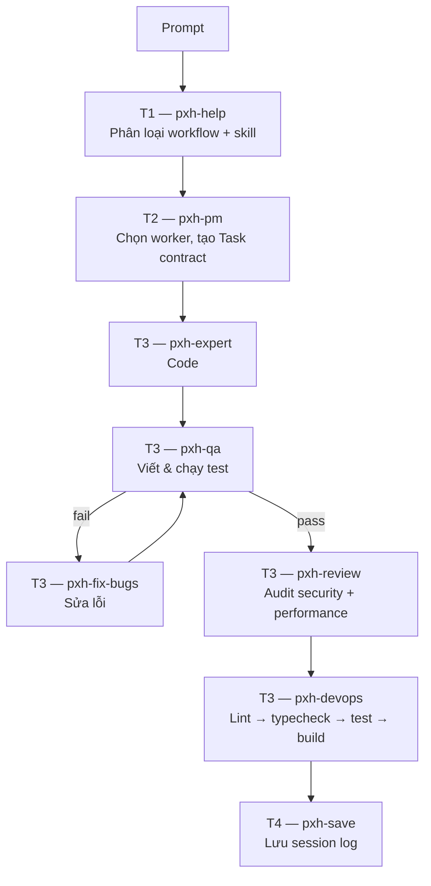
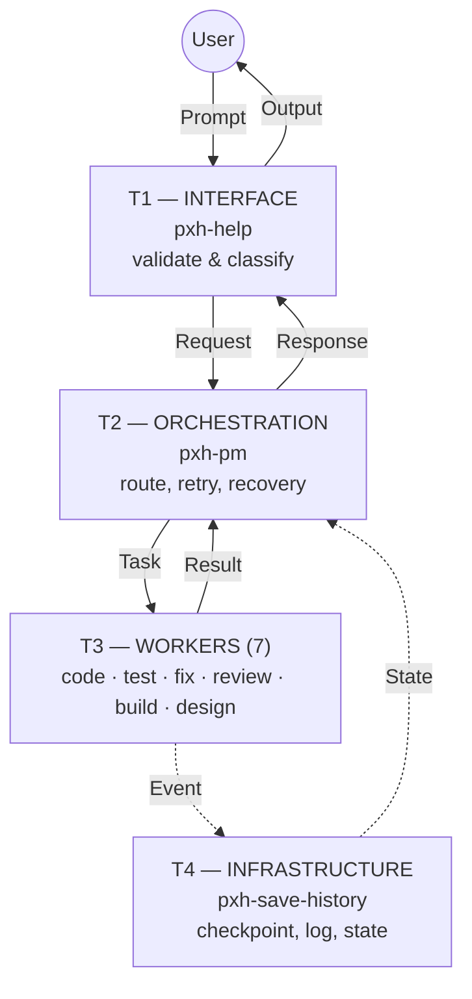

# pxhopencode — Vibe Coding with OpenCode

<p align="center">
  <b>v49</b> &nbsp;·&nbsp; 154 commits &nbsp;·&nbsp; 11 AI agents &nbsp;·&nbsp; 4-tier runtime &nbsp;·&nbsp; 9 workflows &nbsp;·&nbsp; 11 commands &nbsp;·&nbsp; 32 skills</p>

> Clone vào project của bạn → mô tả ý tưởng bằng tiếng Việt → AI team tự động phân tích, code, test, fix, review, build. Bạn chỉ cần ngồi xem Virtual Office chạy.

---

## Cài đặt (30 giây)

```bash
# Trong thư mục project của bạn:
git clone https://github.com/<repo-url> .opencode
```

Mở project bằng [OpenCode](https://opencode.ai) — AI team tự động load. Không cần cấu hình gì thêm.

> **Docs đầy đủ:** [docs-vibe/index.html](docs-vibe/index.html) — kiến trúc, agents, workflows, Virtual Office.

---

## 3 Cách Vibe Code

Bạn mô tả ý tưởng. Hệ thống lo toàn bộ phần còn lại. Không cần biết agent nào, skill nào — hệ thống tự quyết định.

### Cách 1: Prompt tự nhiên (khuyên dùng)

Gõ thẳng mô tả công việc bằng tiếng Việt. Hệ thống tự phân loại → chọn workflow → route agent → thực thi:

```
"Xây dựng web blog cá nhân với React, có dark mode"
"Làm game platformer 2D, nhân vật mèo nhảy qua chướng ngại vật, thu thập coin"
"Tạo chatbot RAG trả lời câu hỏi từ tài liệu PDF nội bộ"
```

**Luồng tự động phía sau:**



### Cách 2: Lệnh `/` — đi thẳng vào workflow

Bỏ qua phân loại, route thẳng vào workflow tương ứng:

| Lệnh | Ví dụ | Dùng khi |
|------|-------|----------|
| `/vibe` | `/vibe xây dựng app quản lý công việc` | Full pipeline 11 bước: phân tích → code → test → review → build |
| `/web` | `/web làm landing page cho startup` | Web app: React, Next.js, Express, FastAPI |
| `/game` | `/game game bắn súng không gian 2D` | Game HTML5: Phaser 2D, Isometric, Three.js 3D |
| `/ai` | `/ai tạo chatbot hỗ trợ khách hàng` | Chatbot, RAG, AI agent, LLM |
| `/tool` | `/tool CLI tool đổi tên file hàng loạt` | CLI, extension, automation, package |
| `/debug` | `/debug game bị giật FPS khi nhiều enemy` | Debug + root cause analysis |
| `/ui-ux` | `/ui-ux thiết kế responsive navbar` | UI/UX design & responsive layout |
| `/meeting` | `/meeting chọn tech stack cho dự án mới` | Họp agents thảo luận kiến trúc |
| `/release` | `/release` | Build pipeline: lint → test → build |
| `/preview` | `/preview` | Live preview game (Vite HMR) |
| `/office` | `/office` | Mở Virtual Office |

### Cách 3: @mention — gọi thẳng agent

Biết chính xác cần agent nào? Gọi trực tiếp, bỏ qua classify & routing:

```
@pxh-expert       viết API endpoint /api/users với CRUD
@pxh-qa           chạy test coverage cho thư mục src/
@pxh-fix-bugs     sửa lỗi crash khi click nút Login
@pxh-review-code  audit bảo mật toàn bộ codebase
@pxh-architect    thiết kế database schema cho app e-commerce
@pxh-devops       build và deploy lên Vercel
@pxh-ui-ux        làm responsive navbar với dark mode
```

---

## Quy trình `/vibe` đầy đủ (11 bước)

Pipeline hoàn chỉnh từ ý tưởng đến production:

| # | Phase | Agent | Công việc |
|---|-------|-------|-----------|
| 1 | NHẬN | T1→T2 | Phân loại prompt, xác định loại dự án |
| 2 | PHÂN TÍCH | T2 | Chọn tech stack, đánh giá quy mô |
| 3 | HỌP | @meeting | Agent council đồng thuận kiến trúc |
| 4 | KẾ HOẠCH | T2 | Feature list, milestones, acceptance criteria |
| 5 | THIẾT KẾ | @pxh-architect | Schema DB, API contract, component tree |
| 6 | CODE | @pxh-expert | Code, .gitignore + favicon |
| 7 | KIỂM TRA | @pxh-qa | Viết test, coverage ≥ 85% |
| 8 | SỬA | @pxh-fix-bugs | Root cause → fix → verify |
| 9 | RÀ SOÁT | @pxh-review-code | Security audit, performance review |
| 10 | PHÁT HÀNH | @pxh-devops | Lint → typecheck → test → build |
| 11 | LƯU | @pxh-save-history | Session log, ADR, STATUS.md |

**Tự động retry loop:** Test fail → quay lại bước 6 (max 3 lần). Critical issue → quay lại bước 8 (max 3 lần). Build fail → quay lại bước 6 (max 3 lần).

---

## Ví dụ thực tế

**Làm web app:**
```
/vibe Xây dựng ứng dụng quản lý chi tiêu cá nhân với React + Express + PostgreSQL.
Cho phép thêm/sửa/xóa giao dịch, phân loại thu/chi, xem biểu đồ thống kê theo tháng.
```
→ Hệ thống tự: phân tích → thiết kế schema → code frontend + backend → test → review → build.

**Làm game:**
```
/game Làm game platformer 2D. Nhân vật mèo chạy nhảy qua chướng ngại vật,
thu thập coin, có 3 mạng. Enemy là chó bay qua lại. Background parallax rừng cây.
```
→ Hệ thống tự: tải assets → scaffold Phaser 3 → code game loop → test headless → polish → build.

**Debug:**
```
/debug Game bị crash khi spawn enemy thứ 50. Console báo "pool exhausted".
```
→ `pxh-fix-bugs`: root cause → fix object pool → verify.

---

## Kiến trúc 4 Tầng



| Tầng | Agent | Vai trò | Rời bàn |
|------|-------|---------|---------|
| **T1** Interface | `pxh-help` | Validate & classify input | Khi TUI kết thúc |
| **T2** Orchestration | `pxh-pm` | Route, policy, retry/recovery | Khi TUI kết thúc |
| **T3** Workers | 7 agents | Code, test, fix, review, build, UI/UX | Xong việc → rời |
| **T4** Infrastructure | `pxh-save-history` | State, checkpoint, log | Xong việc → rời |

---

## Tham khảo: Tất cả Agents

| Agent | Tầng | Chuyên môn | @mention khi |
|-------|------|------------|-------------|
| `pxh-help` | T1 | Interface | (tự động — classify input) |
| `pxh-pm` | T2 | Orchestration | (tự động — route task) |
| `pxh-architect` | T3 | Thiết kế | Cần DB schema, API design, chọn tech stack |
| `pxh-expert` | T3 | Code | Cần code production |
| `pxh-fix-bugs` | T3 | Debug | Có bug, cần root cause |
| `pxh-qa` | T3 | Test | Cần viết test hoặc check coverage |
| `pxh-review-code` | T3 | Review | Cần security audit hoặc perf review |
| `pxh-devops` | T3 | Build | Cần lint → typecheck → test → build |
| `pxh-ui-ux` | T3 | Thiết kế | Cần layout, responsive, accessibility |
| `pxh-save-history` | T4 | Infrastructure | (tự động — save session) |
| `pxh-office` | Virtual | Office | Visual dashboard real-time |

---

## Virtual Office — VS Code Extension

Visual hóa văn phòng mở real-time với 11 nhân vật pixel-art, thú cưng, speech bubbles:

### Cài đặt Extension

```powershell
.\pxh-install-extension.bat install          # VS Code Stable
.\pxh-install-extension.bat install insiders  # VS Code Insiders
.\pxh-install-extension.bat uninstall         # Gỡ cài đặt
```

Restart VS Code → Virtual Office xuất hiện ở sidebar.

### Chạy server riêng (browser)

```powershell
.\pxh-office.bat on       # Start + mở browser tại http://localhost:2910
.\pxh-office.bat off      # Tắt server
.\pxh-office.bat restart  # Khởi động lại
```

### Tính năng

- **11 pixel-art agents** với trang phục + phụ kiện riêng, ngồi làm việc tại bàn
- **Mèo 🐱 + Chó 🐕** đi dạo tự do trong văn phòng
- **Speech bubbles** real-time hiển thị log của từng agent
- **Dashed signals** nối agents theo data flow
- **State badges** nhấp nháy cạnh tên — biết agent nào đang làm gì ngay lập tức

---

## Chính sách

| Policy | Cơ chế | Giới hạn |
|--------|--------|----------|
| **Retry** | Exponential backoff (1s → 2s → 4s) | Max 3 lần |
| **Recovery** | Checkpoint-based resume / rollback | Lỗi permanent |
| **Reflection** | 4 mức: Task → Phase → Workflow → Incident | Ghi session log |

---

## Key Concepts

- **Prompt Optimizer**: Tự động rewrite prompt mơ hồ → rõ ràng, hiển thị panel `<details>`, transparent
- **Contract Communication**: Agents giao tiếp qua typed contracts, không @mention trần
- **Context Budget**: Lazy-load skills, compaction tự động, giới hạn 50 line/4096 byte output
- **Live Preview**: `skills/games-preview/` — Vite HMR, hot-reload < 50ms
- **Portable**: Copy toàn bộ `.opencode` folder → hoạt động ngay trong project mới

---

## Changelog

<details>
<summary><b>v49 — User Guide Rewrite (Latest)</b></summary>

- **Rewrite:** README repositioned as practical user guide — focus on "how to vibe code" over internal docs
- **Restructure:** 3 cách vibe code front-and-center, kiến trúc simplified, virtual office concise
- **Update:** Commit count sync (141 → 154), version bump v48 → v49
- **Update:** STATUS.md changelog
</details>

<details>
<summary><b>v48 — Prompt Optimizer</b></summary>

- **Add:** `prompt-optimizer.md` — auto-rewrite prompt mơ hồ thành implementation-ready spec
- **Add:** Collapsible `<details>` panel hiển thị original vs optimized prompt
- **Add:** Context-aware optimization — giữ nguyên goal, chỉ resolve ambiguity
- **Add:** Integration vào `opencode.json` instructions, chạy trước mọi user task
</details>

<details>
<summary><b>v47 — Bat Merge & README Sync</b></summary>

- **Merge:** `pxh-office-on.bat` + `pxh-office-off.bat` → `pxh-office.bat` (on/off/restart + help)
- **Remove:** `pxh-office-on.bat`, `pxh-office-off.bat`
</details>

<details>
<summary><b>v46 — Open Office & Real-time Agent Sync</b></summary>

- **Redesign:** Virtual Office thành văn phòng mở single-floor, 11 agent làm việc chung
- **Add:** 11 agent với pixel-art character, trang phục riêng, phụ kiện
- **Add:** Mèo 🐱 + Chó 🐕 đi dạo tự do trong văn phòng
- **Add:** Speech bubble real-time, dashed signal lines, state badges
- **Add:** `pxh-office.bat` — ON/OFF/RESTART server 1 lệnh, port 2910
</details>

<details>
<summary><b>v45 — Virtual Office TUI</b></summary>

- **Add:** `pxh-office` agent — Virtual Office TUI với pixel-art agents
- **Add:** Webview 2D Cartoon, SSE event sync, contract flow animation
</details>

<details>
<summary><b>v32–v44 — Foundation & Hardening</b></summary>

- v44: Context compaction, tool output truncation, skill lazy loading, live preview
- v43: AI Studio debug pipeline, Polish Pipeline, game eval assertions
- v42: Godot removal
- v40: Observability & Alerting, Contract versioning, Mermaid diagrams
- v32: Initial foundation — 4-tier architecture, 10 agents, 8 workflows, 28 skills
</details>
