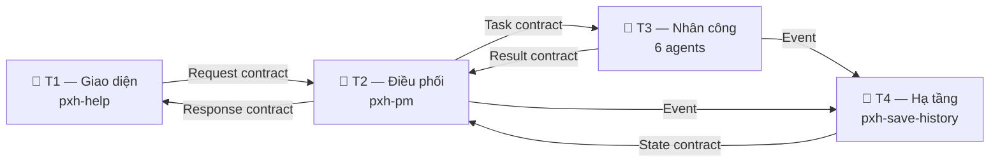
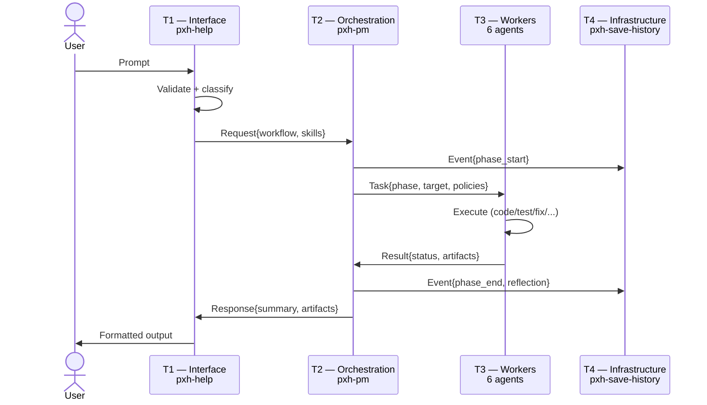
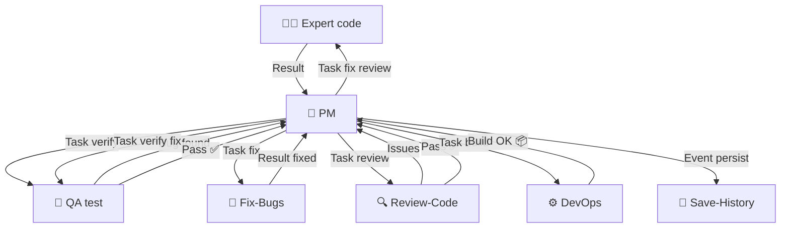

# pxhopencode — AI Company cho Vibe Coding

Hệ thống AI agents tự động vibe code như một AI Company. Copy vào `.opencode/` → viết prompt → agents tự động thảo luận → code → test → fix → release. Enterprise AI Runtime 4-layer, structured contracts, retry/recovery/reflection policies.

**Phiên bản:** 2.0 | **License:** MIT | **Tác giả:** Phạm Xuân Hoài — [Error404-Labs.Info.Vn](https://error404-labs.info.vn)

---

## 🤖 9 AI Agents chuyên biệt

| Agent | Tầng | Nhiệm vụ |
|-------|------|----------|
| `pxh-pm` | T2 — Điều phối | CEO: điều phối, routing, thi hành chính sách |
| `pxh-architect` | T3 — Kiến trúc | Thiết kế tech stack, DB, API |
| `pxh-expert` | T3 — Lập trình | Vibe code, chọn workflow + skill |
| `pxh-fix-bugs` | T3 — Sửa lỗi | Stack trace → root cause → fix |
| `pxh-qa` | T3 — Kiểm thử | Chạy test, xác thực chất lượng |
| `pxh-review-code` | T3 — Rà soát | Bảo mật, hiệu năng, quy ước |
| `pxh-devops` | T3 — Build | Lint → typecheck → test → build |
| `pxh-save-history` | T4 — Hạ tầng | Lưu state, checkpoint, phục hồi |
| `pxh-help` | T1 — Giao diện | Hướng dẫn chọn workflow |

## 🏛 Enterprise AI Runtime (4 Tầng)



Luồng thực thi:



Giao tiếp qua 6 contract: `Request` | `Task` | `Result` | `Response` | `Event` | `State`.
Chính sách: `Thử lại` (exp backoff, max 3) | `Phục hồi` (checkpoint) | `Phản ánh` (4 mức).

## 🔄 Feedback Loop



Vòng lặp: **Code → Test → Fix** (max 3). **Review → Fix → Test** (max 3). **Build fail → Fix** (max 3). Quá → báo user.

## 🌐 8 Workflow

`vibe` (full company) | `web` | `game` (2D/2.5D/3D) | `ai` | `tool` (CLI/extension/package) | `debug` | `meeting` | `release`

## 🛠 25 Skills

`webs-*` (7) | `games-*` (8) | `ais-*` (5) | `tools-*` (5)

## 🎯 Tính năng doanh nghiệp

- **Enterprise AI Runtime 4 tầng**: Interface → Orchestration → Workers → Infrastructure. Giao tiếp qua contract, cách ly hoàn toàn.
- **Chính sách Production**: Retry (exponential backoff, max 3), Recovery (checkpoint-based), Reflection (4 mức).
- **Feedback Loop tự động**: Code → Test → Fix → Review → Build. Mỗi vòng lặp giới hạn, tránh infinite loop.
- **Context Budget**: Tiered loading T0→T3, lazy skill/template, batch ops — ~50% token/phiên.
- **Conversation Budget**: Max rounds/task, chặn lãng phí token.
- **Chrome DevTools MCP debug**: Preview game real-time qua chrome-devtools (`--autoConnect`). Vào `chrome://inspect/#remote-debugging` bật remote debugging là dùng được.
- **25 Skills Production**: Web (React/Next/Express/FastAPI), Game (Phaser/Three.js/Isometric), AI (RAG/LLM/Agent), Tool (CLI/Extension/Automation).
- **143 Templates sẵn sàng**: Không code từ đầu — copy, paste, tùy chỉnh.
- **Favicon SVG tự động**: Mỗi workflow có màu sắc riêng.
- **Bảo toàn code**: Chỉ tác động trong TARGET, không phá code cũ.

## 🚀 Dành cho Doanh nghiệp

| Nhu cầu | Giải pháp |
|---------|-----------|
| Phát triển web app | Workflow Web + 7 webs-* skills |
| Phát triển game HTML5 | Workflow Game + 8 games-* skills + Chrome DevTools preview |
| AI Chatbot / RAG | Workflow AI + 5 ais-* skills |
| CLI / Extension / Tool | Workflow Tool + 5 tools-* skills |
| Debug & Fix bug | Workflow Debug + pxh-fix-bugs agent |
| Release Pipeline | Workflow Release + pxh-devops agent |

## 📦 Cài đặt

```bash
# macOS / Linux
cp -r ../pxhopencode .opencode

# Windows (PowerShell)
Copy-Item -Recurse ../pxhopencode .opencode
```

### Yêu cầu hệ thống
- **Node.js** 18+ (cho web/game/tool development)
- **npm** hoặc **yarn**
- **Brave/Chrome** (cho chrome-devtools MCP preview)
- **PowerShell** 5.1+ (Windows) hoặc bash (macOS/Linux)

## 📁 Cấu trúc

```
.opencode/
├── opencode.json   # Config chính
├── README.md       # Tài liệu
├── STATUS.md       # Dashboard real-time
├── LICENSE         # MIT
├── .gitignore      # Tự động
├── agents/         # 9 agents (T1-T4)
├── runtime/        # 4 tầng + contracts + policies
├── workflows/      # 8 workflow templates
├── skills/         # 4 lĩnh vực, 25 skills + 143 templates
└── _shared/        # Dùng chung: context-budget, skill-quickref, scripts, templates
```

## 💡 Cách dùng

- **Prompt trực tiếp**: `pxh-pm` tự động phân tích → chọn workflow → code → test → release
- **Lệnh `/`**: `/vibe` | `/web` | `/game` | `/ai` | `/tool` | `/debug` | `/release` | `/meeting`
- **Gọi `@agent`** (kèm Task contract): `@pxh-expert` với task rõ ràng, `@pxh-architect`, etc.

### Cross-platform notes
- Config mặc định dùng `npx.cmd` (Windows). Trên macOS/Linux, đổi thành `npx` trong `opencode.json`.
- Script asset download dùng PowerShell (`_shared/scripts/download-games-assets.ps1`). Trên macOS/Linux, cài `pwsh` hoặc tải thủ công.

## 📄 License

MIT License — xem [LICENSE](LICENSE).

---

**Tác giả: Phạm Xuân Hoài — [Error404-Labs.Info.Vn](https://error404-labs.info.vn)**
