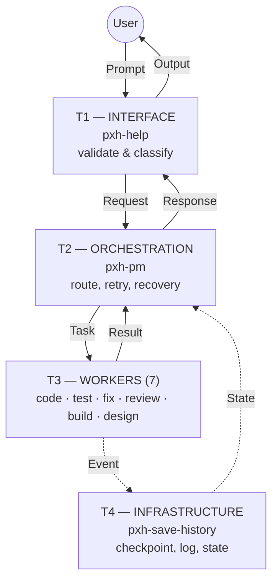

# pxhopencode — Vibe Coding with OpenCode

<p align="center">
  <b>v82.4</b> &nbsp;·&nbsp; 10 AI agents &nbsp;·&nbsp; 4-tier runtime &nbsp;·&nbsp; 8 workflows &nbsp;·&nbsp; 50 skills &nbsp;·&nbsp; 49 self-tests &nbsp;·&nbsp; 6 contracts
</p>

> Nhúng vào project → mô tả ý tưởng bằng tiếng Việt → AI team tự động phân tích, code, test, fix, review, build.

---

## Cài đặt (30 giây)

Nhúng vào project có sẵn:

```bash
cd project-của-bạn
git clone https://github.com/kitajima2910/pxhopencode.git .opencode
```

Sau đó chạy init:

| Cách | Lệnh |
|------|------|
| **CMD** | `.opencode\start.bat` |
| **PowerShell** | `powershell -ExecutionPolicy Bypass -File ".opencode/_shared/scripts/start.ps1"` |

Hoặc chỉ clone rồi chạy `opencode` — init script tự động chạy ở prompt đầu tiên.

Init script tự động: xoá `.opencode/.git/` (tránh nested repo), merge `.gitignore` entries vào parent project (`.opencode/`, `.github/`, `.vibe/`, `.memory/`, `__prompt-log__.md`), tạo 13 files `.opencode/.memory/`.

> **Docs đầy đủ:** [docs-vibe/index.html](docs-vibe/index.html)

---

## Runtime Engine + CLI

| Công cụ | Lệnh | Chức năng |
|---------|------|-----------|
| **Runtime engine** | `runtime/engine/` | Zod contracts, pipeline executor, intent router, memory I/O |
| **Self-tests** | `npm test` (trong `.opencode/`) | 49 tests: contracts, pipeline, router, architecture integrity |
| **Status** | `/status` trong opencode | Xem memory entries + pipeline state |
| **Feedback** | `/feedback` trong opencode | Gửi feedback → `.opencode/.memory/feedback.json` |
| **Resume** | `/resume` trong opencode | Tiếp tục session dang dở |
| **Init project** | `/init` trong opencode | Scaffold project mới (web/game/ai/tool) |

---

## Kiến trúc 4 Tầng


```mermaid
flowchart TD
    User((User))
    T1["T1 — INTERFACE<br/>pxh-help<br/>validate & classify"]
    T2["T2 — ORCHESTRATION<br/>pxh-pm<br/>route, retry, recovery"]
    T3["T3 — WORKERS (7)<br/>code · test · fix · review · build · design"]
    T4["T4 — INFRASTRUCTURE<br/>pxh-save-history<br/>checkpoint, log, state"]

    User -->|Prompt| T1
    T1 -->|Request| T2
    T2 -->|Task| T3
    T3 -->|Result| T2
    T2 -->|Response| T1
    T1 -->|Output| User
    T3 -.->|Event| T4
    T4 -.->|State| T2
```

| Tầng | Agent | Vai trò |
|------|-------|---------|
| **T1** Interface | `pxh-help` | Validate & classify input |
| **T2** Orchestration | `pxh-pm` | Route, policy, retry/recovery |
| **T3** Workers | 7 agents | Code, test, fix, review, build, UI/UX |
| **T4** Infrastructure | `pxh-save-history` | State, checkpoint, log |

---

## Tham khảo nhanh

| Agents (10) | Workflows (8) | Skills (50) | Contracts (6) |
|------------|---------------|-------------|---------------|
| `agents/*.md` | `workflows/*.md` | `skills/*/SKILL.md` | `runtime/contracts/README.md` |

Changelog: `STATUS.md`
