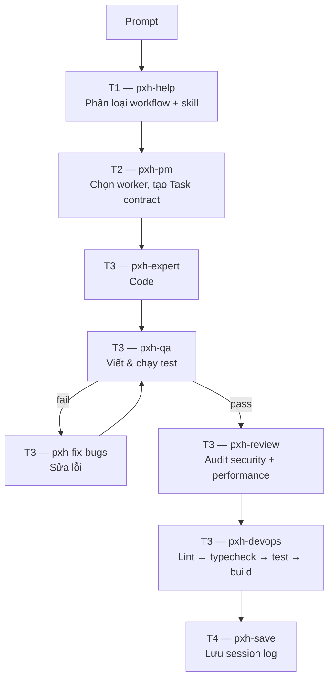
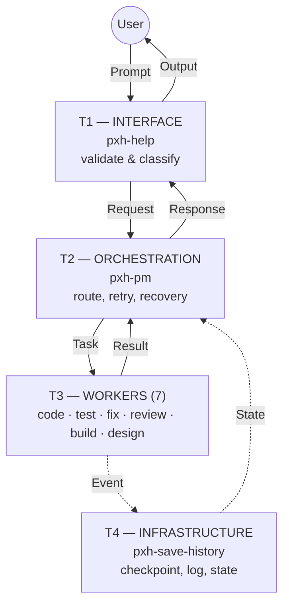

# pxhopencode — Vibe Coding with OpenCode

<p align="center">
  <b>v79.1</b> &nbsp;·&nbsp; 216 commits &nbsp;·&nbsp; 10 AI agents &nbsp;·&nbsp; 4-tier runtime &nbsp;·&nbsp; 8 workflows &nbsp;·&nbsp; 50 skills &nbsp;·&nbsp; 154 templates</p>

> Clone vào project của bạn → mô tả ý tưởng bằng tiếng Việt → AI team tự động phân tích, code, test, fix, review, build.

---

## Cài đặt (30 giây)

### A — Dùng source trực tiếp (khuyên dùng)

Clone pxhopencode và mở bằng OpenCode ngay trong thư mục source:

```bash
git clone https://github.com/<repo-url> pxhopencode
cd pxhopencode
opencode
```

### B — Nhúng vào project có sẵn

```bash
cd project-của-bạn
git clone https://github.com/<repo-url> .opencode
opencode
```

> `.opencode/` tự động được thêm vào `.gitignore` project của bạn (bởi init script khi chạy lần đầu). Không lo commit nhầm AI Company lên GitHub.

> **Docs đầy đủ:** [docs-vibe/index.html](docs-vibe/index.html)

## Cấu trúc source

```
pxhopencode/
├── opencode.json        # Config: agents, commands, skills
├── README.md / STATUS.md
├── agents/              # 10 AI agents
├── runtime/             # 4 tầng + contracts + policies + memory
├── workflows/           # 8 workflow templates
├── skills/              # 49 skills theo lĩnh vực
├── docs-vibe/           # Tài liệu kiến trúc
├── _shared/             # Scripts, templates dùng chung
└── .memory/             # Vibe Coding Memory (tự động)
```

---

## 3 Cách Vibe Code

Bạn mô tả ý tưởng. Hệ thống lo toàn bộ phần còn lại. Không cần biết agent nào, skill nào — hệ thống tự quyết định.

### Cách 1: Prompt tự nhiên (khuyên dùng)

Gõ thẳng mô tả công việc bằng tiếng Việt. Hệ thống tự phân loại → chọn workflow → route agent → thực thi:

```
"Xây dựng web blog cá nhân với React, có dark mode"
"Làm game platformer 2D, nhân vật mèo nhảy qua chướng ngại vật, thu thập coin"
"Tạo chatbot RAG trả lời câu hỏi từ tài liệu PDF nội bộ"
```

**Luồng tự động phía sau:**


```mermaid
flowchart TD
    A[Prompt] --> B["T1 — pxh-help<br/>Phân loại workflow + skill"]
    B --> C["T2 — pxh-pm<br/>Chọn worker, tạo Task contract"]
    C --> D["T3 — pxh-expert<br/>Code"]
    D --> E["T3 — pxh-qa<br/>Viết & chạy test"]
    E -->|fail| F["T3 — pxh-fix-bugs<br/>Sửa lỗi"]
    F --> E
    E -->|pass| G["T3 — pxh-review<br/>Audit security + performance"]
    G --> H["T3 — pxh-devops<br/>Lint → typecheck → test → build"]
    H --> I["T4 — pxh-save<br/>Lưu session log"]
```

### Cách 2: Lệnh `/` — đi thẳng vào workflow

Bỏ qua phân loại, route thẳng vào workflow tương ứng:

| Lệnh | Ví dụ | Dùng khi |
|------|-------|----------|
| `/vibe` | `/vibe xây dựng app quản lý công việc` | Full pipeline 11 bước: phân tích → code → test → review → build |
| `/web` | `/web làm landing page cho startup` | Web app: React, Next.js, Express, FastAPI |
| `/3d` | `/3d tạo product configurator 3D với Three.js` | 3D web experience: Three.js, R3F, Spline, WebGL |
| `/game` | `/game game bắn súng không gian 2D` | Game HTML5: Phaser 2D, Isometric, Three.js 3D |
| `/ai` | `/ai tạo chatbot hỗ trợ khách hàng` | Chatbot, RAG, AI agent, LLM |
| `/tool` | `/tool CLI tool đổi tên file hàng loạt` | CLI, extension, automation, package |
| `/debug` | `/debug game bị giật FPS khi nhiều enemy` | Debug + root cause analysis |
| `/ui-ux` | `/ui-ux thiết kế responsive navbar` | UI/UX design & responsive layout |
| `/meeting` | `/meeting chọn tech stack cho dự án mới` | Họp agents thảo luận kiến trúc |
| `/release` | `/release` | Build pipeline: lint → test → build |
| `/preview` | `/preview` | Live preview game (Vite HMR) |

### Cách 3: @mention — gọi thẳng agent

Biết chính xác cần agent nào? Gọi trực tiếp, bỏ qua classify & routing:

```
@pxh-expert       viết API endpoint /api/users với CRUD
@pxh-qa           chạy test coverage cho thư mục src/
@pxh-fix-bugs     sửa lỗi crash khi click nút Login
@pxh-review-code  audit bảo mật toàn bộ codebase
@pxh-architect    thiết kế database schema cho app e-commerce
@pxh-devops       build và deploy lên Vercel
@pxh-ui-ux        làm responsive navbar với dark mode
```

---

## Quy trình `/vibe` đầy đủ (11 bước)

Pipeline hoàn chỉnh từ ý tưởng đến production:

| # | Phase | Agent | Công việc |
|---|-------|-------|-----------|
| 1 | NHẬN | T1→T2 | Phân loại prompt, xác định loại dự án |
| 2 | PHÂN TÍCH | T2 | Chọn tech stack, đánh giá quy mô |
| 3 | HỌP | @meeting | Agent council đồng thuận kiến trúc |
| 4 | KẾ HOẠCH | T2 | Feature list, milestones, acceptance criteria |
| 5 | THIẾT KẾ | @pxh-architect | Schema DB, API contract, component tree |
| 6 | CODE | @pxh-expert | Code, .gitignore + favicon |
| 7 | KIỂM TRA | @pxh-qa | Viết test, coverage ≥ 85% |
| 8 | SỬA | @pxh-fix-bugs | Root cause → fix → verify |
| 9 | RÀ SOÁT | @pxh-review-code | Security audit, performance review |
| 10 | PHÁT HÀNH | @pxh-devops | Lint → typecheck → test → build |
| 11 | LƯU | @pxh-save-history | Session log, ADR, STATUS.md |

**Tự động retry loop:** Test fail → quay lại bước 6 (max 3 lần). Critical issue → quay lại bước 8 (max 3 lần). Build fail → quay lại bước 6 (max 3 lần).

---

## Ví dụ thực tế

**Làm web app:**
```
/vibe Xây dựng ứng dụng quản lý chi tiêu cá nhân với React + Express + PostgreSQL.
Cho phép thêm/sửa/xóa giao dịch, phân loại thu/chi, xem biểu đồ thống kê theo tháng.
```
→ Hệ thống tự: phân tích → thiết kế schema → code frontend + backend → test → review → build.

**Làm game:**
```
/game Làm game platformer 2D. Nhân vật mèo chạy nhảy qua chướng ngại vật,
thu thập coin, có 3 mạng. Enemy là chó bay qua lại. Background parallax rừng cây.
```
→ Hệ thống tự: tải assets → scaffold Phaser 3 → code game loop → test headless → polish → build.

**Debug:**
```
/debug Game bị crash khi spawn enemy thứ 50. Console báo "pool exhausted".
```
→ `pxh-fix-bugs`: root cause → fix object pool → verify.

---

## Kiến trúc 4 Tầng


```mermaid
flowchart TD
    User((User))
    T1["T1 — INTERFACE<br/>pxh-help<br/>validate & classify"]
    T2["T2 — ORCHESTRATION<br/>pxh-pm<br/>route, retry, recovery"]
    T3["T3 — WORKERS (7)<br/>code · test · fix · review · build · design"]
    T4["T4 — INFRASTRUCTURE<br/>pxh-save-history<br/>checkpoint, log, state"]

    User -->|Prompt| T1
    T1 -->|Request| T2
    T2 -->|Task| T3
    T3 -->|Result| T2
    T2 -->|Response| T1
    T1 -->|Output| User
    T3 -.->|Event| T4
    T4 -.->|State| T2
```

| Tầng | Agent | Vai trò | Rời bàn |
|------|-------|---------|---------|
| **T1** Interface | `pxh-help` | Validate & classify input | Khi TUI kết thúc |
| **T2** Orchestration | `pxh-pm` | Route, policy, retry/recovery | Khi TUI kết thúc |
| **T3** Workers | 7 agents | Code, test, fix, review, build, UI/UX | Xong việc → rời |
| **T4** Infrastructure | `pxh-save-history` | State, checkpoint, log | Xong việc → rời |

---

## Tham khảo: Tất cả Agents

| Agent | Tầng | Chuyên môn | @mention khi |
|-------|------|------------|-------------|
| `pxh-help` | T1 | Interface | (tự động — classify input) |
| `pxh-pm` | T2 | Orchestration | (tự động — route task) |
| `pxh-architect` | T3 | Thiết kế | Cần DB schema, API design, chọn tech stack |
| `pxh-expert` | T3 | Code | Cần code production |
| `pxh-fix-bugs` | T3 | Debug | Có bug, cần root cause |
| `pxh-qa` | T3 | Test | Cần viết test hoặc check coverage |
| `pxh-review-code` | T3 | Review | Cần security audit hoặc perf review |
| `pxh-devops` | T3 | Build | Cần lint → typecheck → test → build |
| `pxh-ui-ux` | T3 | Thiết kế | Cần layout, responsive, accessibility |
| `pxh-save-history` | T4 | Infrastructure | (tự động — save session) |

---

## Chính sách

| Policy | Cơ chế | Giới hạn |
|--------|--------|----------|
| **Retry** | Exponential backoff (1s → 2s → 4s) | Max 3 lần |
| **Recovery** | Checkpoint-based resume / rollback | Lỗi permanent |
| **Reflection** | 4 mức: Task → Phase → Workflow → Incident | Ghi session log |

---

## Key Concepts

- **Prompt Optimizer**: Tự động rewrite prompt mơ hồ → rõ ràng, hiển thị panel `<details>`, transparent
- **Contract Communication**: Agents giao tiếp qua typed contracts, không @mention trần
- **Context Budget**: Lazy-load skills, compaction tự động, giới hạn 50 line/4096 byte output
- **Live Preview**: `skills/games-preview/` — Vite HMR, hot-reload < 50ms
- **Portable**: Copy pxhopencode vào project — hoạt động ngay. Hoặc dùng source trực tiếp.
- **Vibe Coding Memory Engine**: Hệ thống knowledge tự động — không phải chat history. Agents tự học project structure, architecture, patterns, bugs, decisions, preferences qua từng session. `.memory/` được auto-create ở workspace root, không cần cấu hình. Chi tiết: `runtime/memory/README.md`

---

## Changelog

Xem chi tiết: `_shared/changelog.md`
