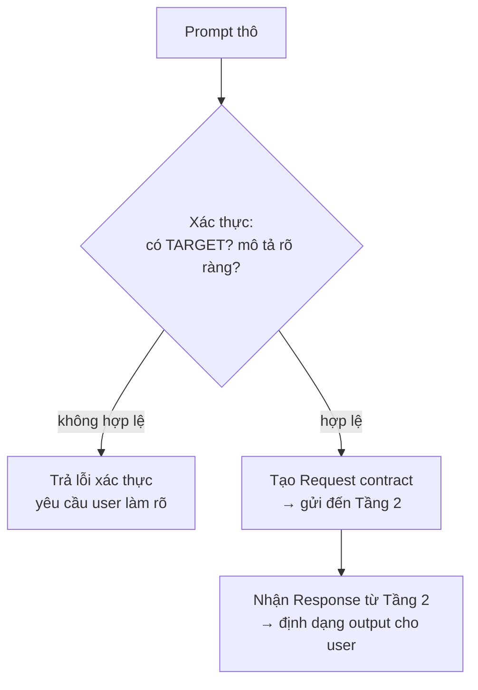

# Tầng 1: Giao diện

**Trách nhiệm:** Đầu vào cho mọi yêu cầu user. Xác thực input, tạo Request contract cấu trúc, trình bày kết quả cuối cho user.

**Chủ quản:** `pxh-help`, user/system prompt

**Trách nhiệm duy nhất:** Xác thực đầu vào + định dạng đầu ra. Không bao giờ thực thi công việc domain.

## Luồng

## Quy tắc
- Mọi Request PHẢI có trường `target`. Nếu thiếu, yêu cầu user chỉ định.
- Không bao giờ sửa đổi payload request — chỉ xác thực và chuyển tiếp.
- Định dạng đầu ra là hậu xử lý duy nhất được phép.

## Đầu vào → Đầu ra
| Đầu vào | Đầu ra |
|---------|--------|
| Text thô từ user | `Request` contract cấu trúc |
| `Response` contract | Tin nhắn đã định dạng cho user |

## Tham chiếu chéo
- **Contracts:** `runtime/contracts/README.md` — Request (đầu ra), Response (đầu vào)
- **Điều phối:** `runtime/layers/02-orchestration.md` — Nhận Request, trả Response
- **Chính sách — Phục hồi:** `runtime/policies/recovery.md` — Phục hồi request không hợp lệ
