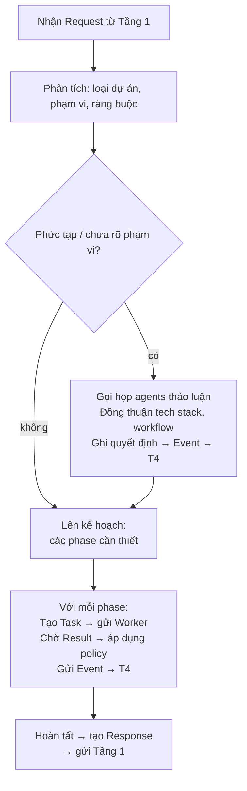
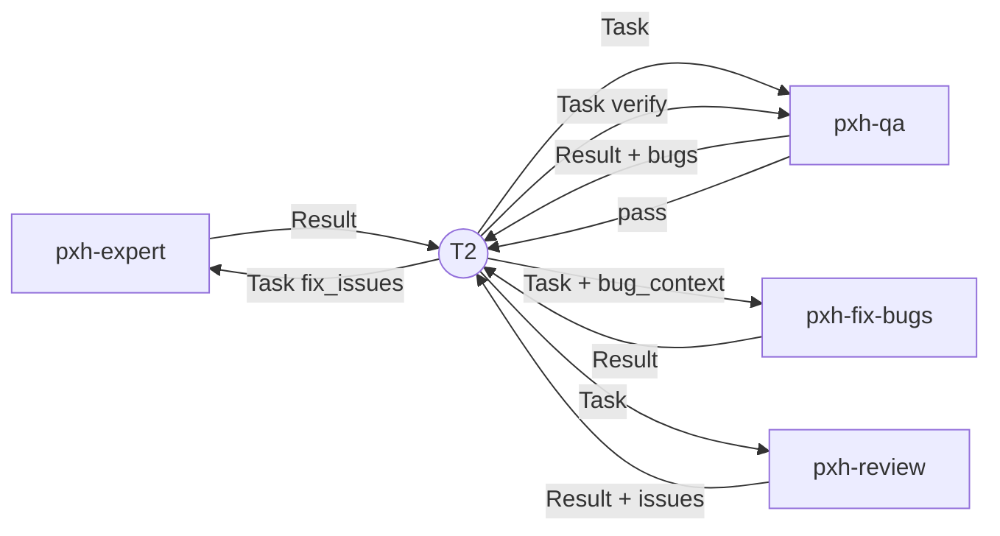

# Tầng 2: Điều phối

**Trách nhiệm:** Quản lý luồng thực thi, route tasks đến workers, theo dõi trạng thái, thi hành chính sách (thử lại/phục hồi/phản ánh).

**Chủ quản:** `pxh-pm`

**Trách nhiệm duy nhất:** Ra quyết định và điều khiển luồng. Không bao giờ thực thi công việc domain.

## Luồng

## Bảng Routing

| Phase | Worker Agent | Loại Contract | Chính sách áp dụng |
|-------|-------------|---------------|-------------------|
| analyze | `pxh-pm` (tự thân) | — | — |
| meeting | `pxh-architect`, `pxh-expert`, `pxh-qa`, `pxh-devops` | — (thảo luận) | — |
| architect | `pxh-architect` | Task → Result | Thử lại, Phản ánh |
| code | `pxh-expert` | Task → Result | Thử lại, Phản ánh |
| fix | `pxh-fix-bugs` | Task → Result | Thử lại, Phục hồi, Phản ánh |
| test | `pxh-qa` | Task → Result | Thử lại, Phản ánh |
| review | `pxh-review-code` | Task → Result | Thử lại, Phản ánh |
| build | `pxh-devops` | Task → Result | Thử lại, Phục hồi, Phản ánh |
| ui-ux | `pxh-ui-ux` | Task → Result | Thử lại, Phản ánh |
| persist | `pxh-save-history` | Event → Confirmed | Phục hồi |

## FEEDBACK LOOP — Phản hồi cấu trúc giữa các worker

Sau mỗi phase, worker PHẢI gửi feedback về T2:

| Worker gửi | Đến | Khi nào | Nội dung |
|-----------|-----|---------|----------|
| `pxh-expert` | T2 | Sau code | `Result{status, artifacts, quality_self_check}` |
| `pxh-qa` | T2 | Sau test | `Result{status, bugs_found[], coverage}` |
| T2 | `pxh-fix-bugs` | Khi có bug | Task contract với `bug_context` từ QA result |
| `pxh-fix-bugs` | T2 | Sau fix | `Result{status, root_cause, fix_summary}` |
| T2 | `pxh-qa` | Sau fix | Task contract với `verify_fix: true` để QA confirm |
| `pxh-review-code` | T2 | Sau review | `Result{status, issues[], critical_count}` |
| T2 | `pxh-expert` | Khi review có issues | Task contract với `fix_review_issues` |

Luồng feedback:

## Quy tắc
- Mọi lời gọi worker PHẢI kèm đầy đủ Task contract fields `{phase, target, context, type, workflow, skills}` — @mention CHỈ là cơ chế gửi, KHÔNG phải thay thế cho contract.
- Không bao giờ route đến worker mà thiếu Task contract — @mention trần (vd: `@pxh-qa` không context) bị cấm.
- Feedback loop PHẢI chạy qua T2 — không worker nào gọi worker khác trực tiếp.
- Trạng thái được quản lý độc quyền qua Hạ tầng (Tầng 4), không bao giờ trong bộ nhớ.
- Mọi quyết định chính sách (thử lại/bỏ qua/leo thang) phải được ghi là Event.
- Thêm Worker mới chỉ cần một dòng trong Bảng Routing — zero thay đổi ở các tầng khác.

## Tham chiếu chéo
- **Contracts:** `runtime/contracts/README.md` — Request (đầu vào), Task (đầu ra), Result (đầu vào), Response (đầu ra), Event (đầu ra), State (đầu vào)
- **Workers:** `runtime/layers/03-worker.md` — Workers nhận Task routing
- **Hạ tầng:** `runtime/layers/04-infrastructure.md` — Lưu trạng thái, checkpoint phục hồi
- **Chính sách — Thử lại:** `runtime/policies/retry.md` — Áp dụng khi worker lỗi tạm thời
- **Chính sách — Phục hồi:** `runtime/policies/recovery.md` — Áp dụng khi lỗi không thử lại được
- **Chính sách — Phản ánh:** `runtime/policies/reflection.md` — Điều phối kích hoạt phản ánh sau mỗi phase
