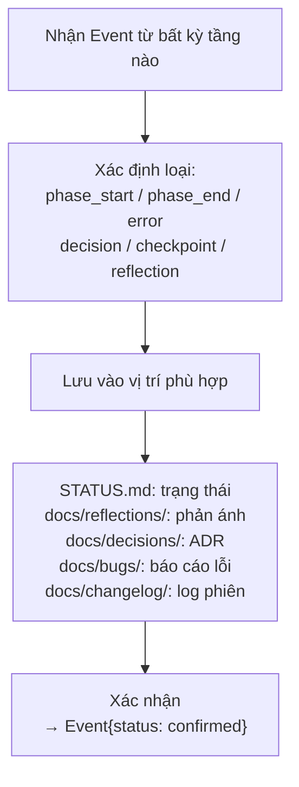

# Tầng 4: Hạ tầng

**Trách nhiệm:** Lưu trạng thái, ghi sự kiện, lưu trữ artifact, phục vụ checkpoint phục hồi.

**Chủ quản:** `pxh-save-history`

**Trách nhiệm duy nhất:** Lưu trữ và truy xuất dữ liệu. Không bao giờ ra quyết định.

## Luồng

## Bảng lưu trữ

| Loại Event | Vị trí lưu | Định dạng |
|-----------|-----------|----------|
| phase_start / phase_end | .opencode/STATUS.md | Markdown |
| error | .opencode/STATUS.md + `.opencode/docs/bugs/` | Markdown |
| decision | `.opencode/docs/decisions/ADR-*.md` | Markdown |
| checkpoint | .opencode/STATUS.md (snapshot) | Markdown |
| reflection | `.opencode/docs/reflections/` | JSON |
| task_result | .opencode/STATUS.md (mục artifacts) | Markdown |

## Tham chiếu chéo
- **Contracts:** `runtime/contracts/README.md` — Event (đầu vào), State (đầu ra)
- **Điều phối:** `runtime/layers/02-orchestration.md` — Gửi Event, yêu cầu State
- **Workers:** `runtime/layers/03-worker.md` — Gửi Event{reflection} sau tasks
- **Chính sách — Phục hồi:** `runtime/policies/recovery.md` — Hạ tầng phục vụ checkpoint cho phục hồi
- **Chính sách — Phản ánh:** `runtime/policies/reflection.md` — Hạ tầng lưu mọi bản ghi phản ánh

## Metrics & Alerting

| Metric | Source | Hành động |
|--------|--------|-----------|
| `phase_retry_count > 3` | Event{type:retry} | Ghi `alert` vào STATUS.md + báo user |
| `agent_failure_rate > 0.3` | Result{status:failure} | Đánh dấu worker degraded |
| `session_loop_count > 3` | Event{type:loop} | Force break → escalate user |
| `artifact_size > 100MB` | Event{type:artifact} | Cảnh báo dung lượng |
| `no_checkpoint > 30min` | Timer | Ghi cảnh báo, tự động checkpoint |

Mỗi metric ghi vào `Event{type:"alert", phase: "observability"}` → lưu `.opencode/STATUS.md` mục `[Alerts]`.

## Quy tắc
- Không bao giờ sửa dữ liệu — append-only cho log, ghi đè `.opencode/STATUS.md` cho trạng thái hiện tại.
- Khi được yêu cầu checkpoint, serialize toàn bộ trạng thái Tầng 2 vào `.opencode/STATUS.md`.
- Khi được yêu cầu phục hồi, trả về trạng thái checkpoint cuối cùng dưới dạng State contract.
- Mọi ghi phải idempotent nếu có thể.
